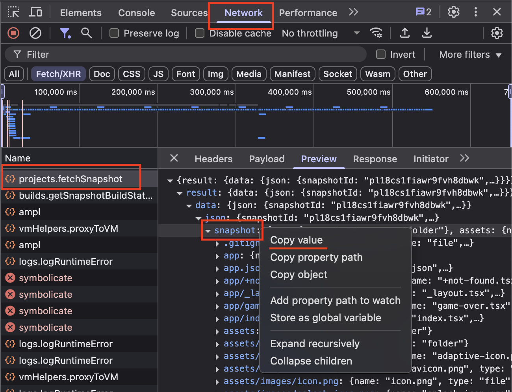

# Rork Project Downloader

A simple, unofficial JavaScript script to download projects created on [rork.app](https://rork.app). Since the platform doesn't provide a free way to download your projects, this script helps you extract and recreate your project files locally.

## 🚀 Features

-   Download your Rork projects locally
-   Preserve file structure and content
-   Support for both text and binary files
-   Simple command-line interface
-   No external dependencies (uses only Node.js built-ins)

## 📋 Prerequisites

-   Node.js installed on your system
-   A project created on rork.app
-   Basic knowledge of browser developer tools

## 🛠️ Installation

1. Clone or download this repository:

```bash
git clone <repository-url>
cd rork-project-downloader
```

2. No additional dependencies required - the script uses only Node.js built-in modules.

## 📖 Usage

### Step 1: Extract Project Data

1. Open your project on [rork.app](https://rork.app)
2. Open your browser's Developer Tools (F12 or right-click → Inspect)
3. Go to the **Network** tab
4. Reload the page (F5 or Ctrl+R)
5. Look for a network request named `projects.fetchSnapshot`
6. Click on this request to view its details
7. Go to the **Preview** tab
8. Find the `snapshot` field in the JSON response
9. Right-click on the `snapshot` field and select **"Copy value"**



### Step 2: Prepare the Data

1. Open the `base.json` file in this project
2. Paste the copied snapshot data into the file
3. Save the file

### Step 3: Generate Project Files

Run the script to create your project files:

```bash
node create-files.js
```

The script will:

-   Read the `base.json` file
-   Create the complete file structure
-   Generate all files with their original content
-   Handle both text and binary files appropriately

### Optional: Clean Mode

If you want to clean existing files before generating new ones:

```bash
node create-files.js --clean
```

## 📁 Project Structure

```
rork-project-downloader/
├── base.json          # Your project data (paste snapshot here)
├── create-files.js    # Main script
├── readme.md          # This file
└── tutorial.png       # Visual guide
```

## 🔧 How It Works

The script processes the JSON data from your Rork project snapshot and:

1. **Parses the JSON structure** - Reads the project data from `base.json`
2. **Creates directories** - Ensures all necessary folders exist
3. **Generates files** - Creates each file with its original content
4. **Handles file types** - Properly processes both text and binary files
5. **Preserves structure** - Maintains the exact folder hierarchy

## ⚠️ Important Notes

-   This is an **unofficial tool** and is not affiliated with rork.app
-   The script only works with projects you have access to
-   Make sure to respect rork.app's terms of service
-   Always backup your work before using this tool

## 🐛 Troubleshooting

### Common Issues

**"Cannot read property of undefined"**

-   Make sure you copied the complete `snapshot` object from the network request
-   Verify the JSON is properly formatted in `base.json`

**"ENOENT: no such file or directory"**

-   Ensure you're running the script from the correct directory
-   Check that `base.json` exists and contains valid data

**Files not created**

-   Verify the snapshot data includes file entries with `type: "file"`
-   Check that the `contents` field is not empty for text files

## 📝 License

This project is open source. Feel free to use, modify, and distribute according to your needs.

## 🤝 Contributing

Contributions are welcome! If you find bugs or have suggestions for improvements, please open an issue or submit a pull request.

## ⚖️ Disclaimer

This tool is provided as-is for educational and personal use. Users are responsible for ensuring they have the right to download and use the projects they extract. The authors are not responsible for any misuse of this tool.
